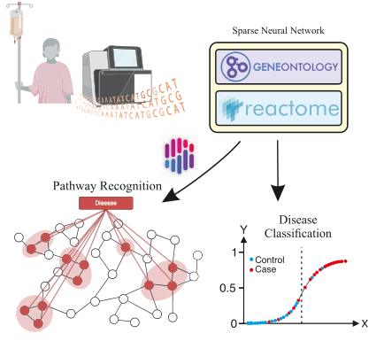

<div align="center">

# CLinNET

### **An Interpretable and Uncertainty-Aware Deep Neural Network for Multi-Modal Clinical Genomics**

[](https://www.python.org/downloads/)
[](https://www.tensorflow.org/)
[](LICENSE)

</div>

---

## Overview



CLinNET is a biologically-informed deep learning framework that integrates multi-modal clinical and genomic data for cancer classification and interpretation. Unlike traditional black-box models, CLinNET leverages biological pathways and gene ontologies to create an interpretable neural network architecture that mirrors the hierarchical organization of cellular processes.

**Key innovations:**
- **Biological pathway integration**: Network architecture guided by Gene Ontology (GO) and Reactome pathways
- **Multi-modal learning**: Combines genomic, transcriptomic, and clinical features
- **Built-in interpretability**: SHAP-based feature attribution and Sankey diagram visualizations
- **Uncertainty quantification**: Monte Carlo dropout for prediction confidence estimation
- **Clinical validation**: Tested on multiple cancer types including prostate and brain tumors

---

## Key Features

✨ **Interpretable by Design**
The model architecture directly encodes biological knowledge, making predictions inherently explainable through pathway-level analysis.

🧬 **Pathway-Aware Architecture**
Hierarchical layers represent genes → pathways → biological processes → cellular functions, ensuring biologically meaningful feature learning.

📊 **Explainability Tools**
Integrated SHAP analysis and interactive Sankey diagrams reveal which genes, pathways, and processes drive predictions.

🎯 **Multi-Modal Integration**
Seamlessly combines gene expression, mutations, copy number variations, and clinical metadata.

⚡ **Production-Ready**
Modular design with easy-to-use APIs for training, evaluation, and deployment.

---

## Model Explainability

CLinNET provides rich interpretability through Sankey diagrams that trace the flow of importance from individual genes through biological pathways to final predictions.

### Example: Prostate Cancer Analysis


*Sankey diagram showing the contribution of genes (left) through pathways and biological processes (middle layers) to the final cancer classification (right). The width of each flow represents the relative importance of that feature in the model's decision.*

This visualization enables clinicians and researchers to:
- Identify key genes driving predictions for individual patients
- Understand which biological pathways are most relevant
- Validate predictions against known cancer biology
- Generate hypotheses for further experimental investigation

---

## Installation

### Prerequisites

- Python 3.8 or higher
- TensorFlow 2.x
- CUDA-compatible GPU (recommended for training)

### Quick Start

**1. Clone the repository:**
```bash
git clone https://github.com/pip-Ivan/CLinNET.git
cd CLinNET
```

**2. Set up the environment using Conda (recommended):**
```bash
conda env create -f environment.yml
conda activate tf_mps
```

**Or install via pip:**
```bash
pip install -r requirements.txt
```

**3. Verify installation:**
```python
from clinnet.model import CLinNET
print("CLinNET successfully installed!")
```

---

## Usage

### Basic Workflow

CLinNET follows a straightforward pipeline: load data → train model → evaluate → interpret.

```python
from clinnet.data_loader_sydney import SydneyData
from clinnet.model import CLinNET
from clinnet.shap import SHAP
from clinnet.sankey import Sankey

# 1. Load and prepare data
data = SydneyData(data_dir='data/sydney_data', balance='undersample')
x_train, y_train, x_valid, y_valid, x_test, y_test, genes, gene_status, class_weight = data.get_kf(kf=3)

# 2. Initialize CLinNET model
clinnet_model = CLinNET(
    genes=genes,
    gene_status=gene_status,
    tissue='brain',  # Specify tissue type for pathway filtering
    saving_dir='SydneyDataset_Run1'
)

# 3. Train the model
clinnet_model.train(
    x_train, y_train,
    x_valid, y_valid,
    batch_size=1024,
    epochs=50,
    verbose=2
)

# 4. Evaluate performance
clinnet_model.evaluate(
    x_valid, y_valid,
    x_test, y_test,
    converge_method='average'
)

# 5. Generate interpretability visualizations
shap_analyzer = SHAP(
    clinnet_model,
    x_train=x_train,
    x_test=x_test,
    y_train=y_train,
    y_test=y_test
)
shap_analyzer.save_shap_plot()
shap_analyzer.save_shap_csv()

# 6. Create Sankey diagram
sankey = Sankey(shap_analyzer)
sankey.plot_sankey(use_abb=True)
```

### Advanced Usage

**Using PNET data:**
```python
from clinnet.data_loader_pnet import PNETData

data = PNETData(data_dir='data/PNET_data')
# Continue with training workflow...
```

**Uncertainty quantification:**
```python
from clinnet.uncertainty import UncertaintyEstimator

uncertainty = UncertaintyEstimator(clinnet_model)
predictions, confidence = uncertainty.predict_with_uncertainty(x_test, n_iterations=100)
```

**Cross-validation:**
```python
from clinnet.cross_validation import CrossValidator

cv = CrossValidator(n_folds=5)
results = cv.run(data, model_params={'tissue': 'prostate'})
```

---

## Repository Structure

```
CLinNET/
├── clinnet/                    # Core package
│   ├── model.py               # Main CLinNET model
│   ├── layers_custom.py       # Custom pathway-aware layers
│   ├── data_loader_sydney.py  # Sydney dataset loader
│   ├── data_loader_pnet.py    # PNET dataset loader
│   ├── shap.py                # SHAP interpretability
│   ├── sankey.py              # Sankey diagram generation
│   ├── uncertainty.py         # Uncertainty quantification
│   ├── network_go.py          # Gene Ontology network builder
│   ├── network_reactome.py    # Reactome pathway network builder
│   └── ...
├── data/                       # Data directory
│   ├── sydney_data/           # Sydney brain tumor dataset
│   ├── PNET_data/             # Prostate cancer dataset
│   ├── Network/               # Pathway network files
│   │   ├── GO/               # Gene Ontology data
│   │   └── Reactome2023/     # Reactome pathway data
│   └── ...
├── assets/                     # Figures and visual materials
│   ├── ClinNet_TOC.pdf        # Visual abstract
│   └── Sankey-epithelial cell of prostate.png
├── notebooks/                  # Jupyter notebooks
│   ├── Train_Model_Sydney.ipynb
│   ├── Train_Model_PNET.ipynb
│   └── Creating_Network.ipynb
├── environment.yml            # Conda environment specification
├── requirements.txt           # Python dependencies
└── README.md                  # This file
```

---

## Data

CLinNET is designed to work with multi-modal clinical genomics data. The repository includes loaders for:

- **Sydney Brain Tumor Dataset**: NDDs samples
- **PNET Dataset**: Prostate cancer samples with genomic and clinical features

Each dataset loader handles:
- Feature preprocessing and normalization
- Class balancing (oversampling/undersampling)
- Train/validation/test splitting
- K-fold cross-validation setup

See individual README files in `data/` subdirectories for format specifications.

---

## Citation

If you use CLinNET in your research, please cite:

```bibtex
@article{clinnet2025,
  title={CLinNET: An Interpretable and Uncertainty-Aware Deep Neural Network for Multi-Modal Clinical Genomics},
  author={Bakhshayeshi.I and Hosseini.MM and Argha. A and Zahedi.A and Lovell.N, and Alinejad-Rokny.H},
  journal={Advanced Science},
  note={Under review},
  year={2025},
  url={https://github.com/pip-Ivan/CLinNET}
}
```

---

## Contributing

We welcome contributions from the community! Here's how you can help:

- **Report bugs**: Open an issue describing the problem
- **Suggest features**: Share your ideas for improvements
- **Submit pull requests**: Fix bugs or add new features
- **Improve documentation**: Help make CLinNET more accessible

Please ensure all pull requests include appropriate tests and documentation.

---

## License

This project is licensed under the MIT License - see the [LICENSE](LICENSE) file for details.

---

## Contact

**Maintainer**: [pip-Ivan](https://github.com/pip-Ivan)

For questions, issues, or collaboration inquiries:
- Open an issue on [GitHub](https://github.com/pip-Ivan/CLinNET/issues)
- Contact the repository owner directly

---

## Acknowledgements

We gratefully acknowledge:
- Contributors and collaborators who made this project possible
- The Gene Ontology and Reactome consortia for pathway data
- Clinical collaborators who provided datasets and domain expertise
- The open-source community for foundational tools and libraries

---

<div align="center">

**Made with ❤️ for advancing interpretable AI in clinical genomics**

</div>
